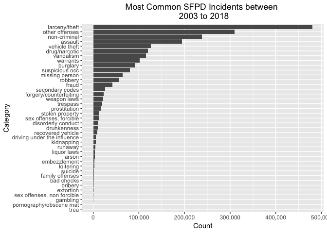
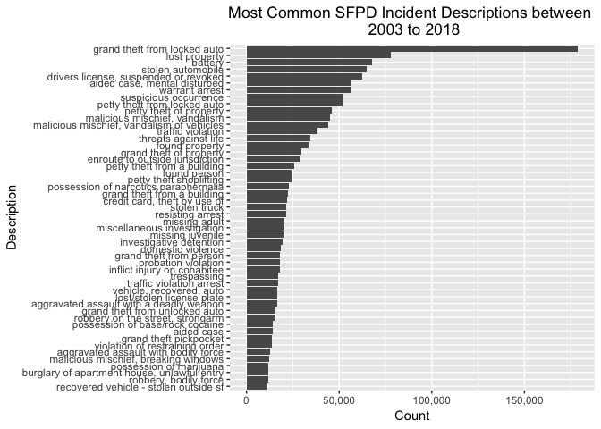
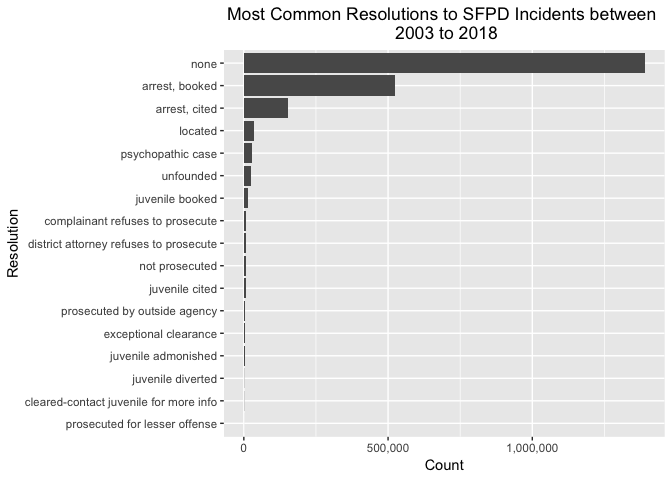
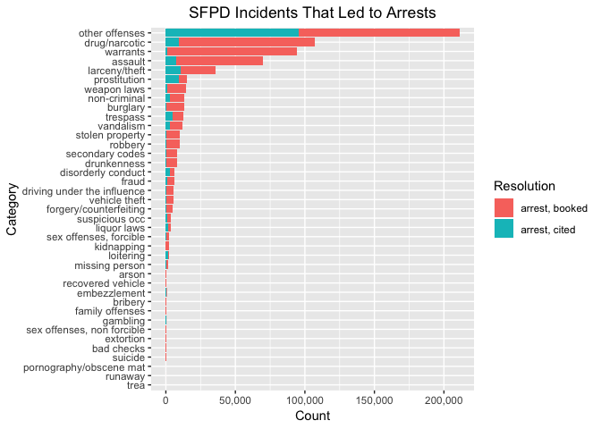
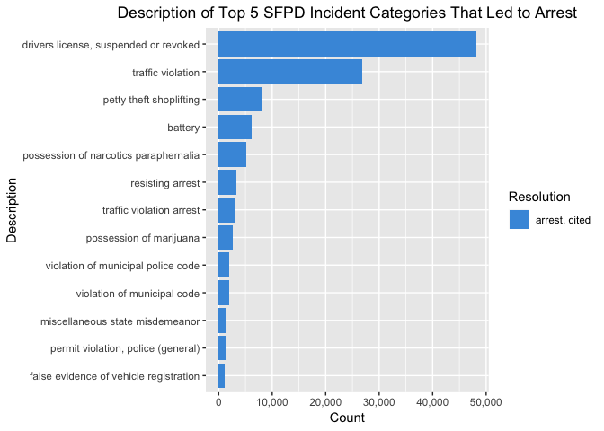
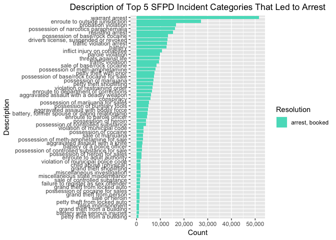
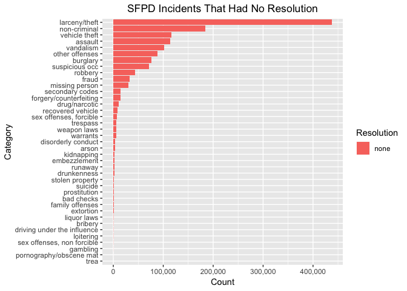
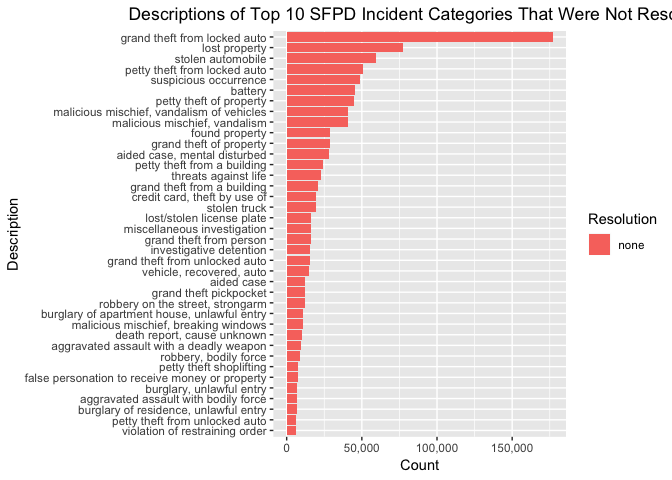
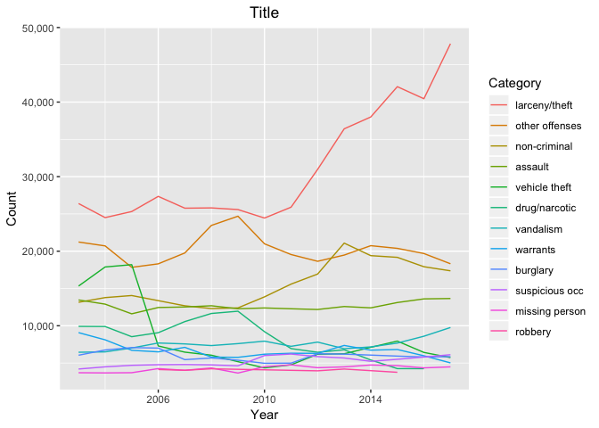
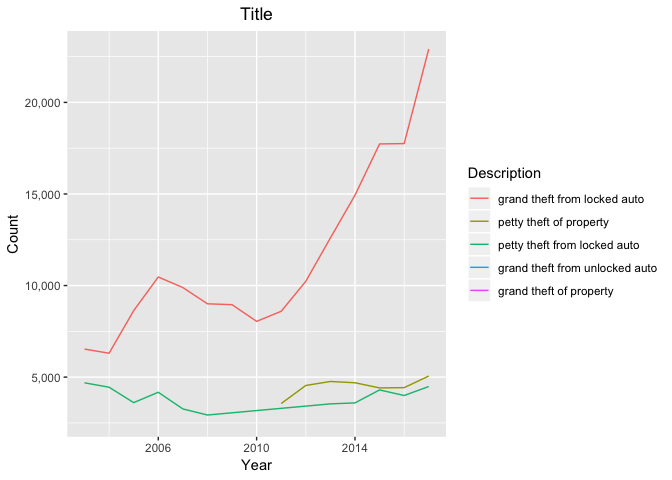

SFPD Incidents (more organized)
================
John Cabiles
3/30/2019

Created Local Branch by Panth Shah
07/19/2020

Introduction
============

This is an analysis of a dataset of SFPD incidents between 2003 and 2018. Every police incident was recorded and uploaded onto the SFPD incident database. Below is a preview of the dataset.

The Dataset
-----------
The dataset can be acquired using [this link to the San Francisco County website](https://data.sfgov.org/api/views/tmnf-yvry/rows.csv).

``` r
table_preview
```

    ## # A tibble: 10 x 22
    ##    IncidntNum Category Description DayOfWeek Date       Time  PdDistrict
    ##         <int> <chr>    <chr>       <fct>     <date>     <tim> <chr>     
    ##  1  150060275 non-cri… lost prope… Monday    2015-01-19 5040… MISSION   
    ##  2  150098210 robbery  robbery, b… Sunday    2015-02-01 5670… TENDERLOIN
    ##  3  150098210 assault  aggravated… Sunday    2015-02-01 5670… TENDERLOIN
    ##  4  150098210 seconda… domestic v… Sunday    2015-02-01 5670… TENDERLOIN
    ##  5  150098226 vandali… malicious … Tuesday   2015-01-27 6840… NORTHERN  
    ##  6  150098232 non-cri… aided case… Sunday    2015-02-01 5886… RICHMOND  
    ##  7  150098248 seconda… domestic v… Saturday  2015-01-31 7560… BAYVIEW   
    ##  8  150098248 vandali… malicious … Saturday  2015-01-31 7560… BAYVIEW   
    ##  9  150098254 burglary burglary o… Saturday  2015-01-31 5814… CENTRAL   
    ## 10  150098260 larceny… petty thef… Saturday  2015-01-31 6120… CENTRAL   
    ## # ... with 15 more variables: Resolution <chr>, Address <chr>, X <dbl>,
    ## #   Y <dbl>, Location <chr>, PdId <dbl>, Month <ord>, Year <dbl>,
    ## #   PersonalCrime <chr>, PropertyCrime <chr>, InchoateCrime <chr>,
    ## #   StatutoryCrime <chr>, AutoCrime <chr>, TheftCrime <chr>,
    ## #   DrugCrime <chr>

General
=======

Incidents by Category
---------------------

``` r
table_unique_categ
```

    ## # A tibble: 39 x 3
    ##    Category        Count Frequency
    ##    <chr>           <int>     <dbl>
    ##  1 larceny/theft  480448      0.22
    ##  2 other offenses 309358      0.14
    ##  3 non-criminal   238323      0.11
    ##  4 assault        194694      0.09
    ##  5 vehicle theft  126602      0.06
    ##  6 drug/narcotic  119628      0.05
    ##  7 vandalism      116059      0.05
    ##  8 warrants       101379      0.05
    ##  9 burglary        91543      0.04
    ## 10 suspicious occ  80444      0.04
    ## # ... with 29 more rows

``` r
plot_unique_categ
```



Incidents by Description
------------------------

``` r
table_unique_descrip
```

    ## # A tibble: 915 x 3
    ##    Description                            Count Frequency
    ##    <chr>                                  <int>     <dbl>
    ##  1 grand theft from locked auto          178836      0.08
    ##  2 lost property                          77956      0.04
    ##  3 battery                                67654      0.03
    ##  4 stolen automobile                      64763      0.03
    ##  5 drivers license, suspended or revoked  62534      0.03
    ##  6 aided case, mental disturbed           56313      0.03
    ##  7 warrant arrest                         56230      0.03
    ##  8 suspicious occurrence                  52490      0.02
    ##  9 petty theft from locked auto           51946      0.02
    ## 10 petty theft of property                46114      0.02
    ## # ... with 905 more rows

``` r
plot_unique_descrip
```



Incidents by Resolution
-----------------------

``` r
table_unique_res
```

    ## # A tibble: 17 x 3
    ##    Resolution                               Count Frequency
    ##    <chr>                                    <int>     <dbl>
    ##  1 none                                   1389500      0.63
    ##  2 arrest, booked                          524979      0.24
    ##  3 arrest, cited                           154789      0.07
    ##  4 located                                  34463      0.02
    ##  5 psychopathic case                        29185      0.01
    ##  6 unfounded                                23799      0.01
    ##  7 juvenile booked                          14158      0.01
    ##  8 complainant refuses to prosecute          8089      0   
    ##  9 district attorney refuses to prosecute    7955      0   
    ## 10 not prosecuted                            7720      0   
    ## 11 juvenile cited                            6587      0   
    ## 12 prosecuted by outside agency              5070      0   
    ## 13 exceptional clearance                     4258      0   
    ## 14 juvenile admonished                       3004      0   
    ## 15 juvenile diverted                          694      0   
    ## 16 cleared-contact juvenile for more info     689      0   
    ## 17 prosecuted for lesser offense               85      0

``` r
plot_unique_res
```



Resolutions: Which Incidents Are Getting Resolved?
==================================================

Top 3 Resolutions
-----------------

As seen above, for 94% of the incidents, either someone was arrested (and they were booked or cited) or nothing happened. If we subset the data to show only that 94% of records, we can find trends in what Categories and Descriptions led to an arrest or led to no resolution.

``` r
sfpd_top3_resolutions
```

    ## # A tibble: 2,069,268 x 22
    ##    IncidntNum Category Description DayOfWeek Date       Time  PdDistrict
    ##         <int> <chr>    <chr>       <fct>     <date>     <tim> <chr>     
    ##  1  150060275 non-cri… lost prope… Monday    2015-01-19 5040… MISSION   
    ##  2  150098210 robbery  robbery, b… Sunday    2015-02-01 5670… TENDERLOIN
    ##  3  150098210 assault  aggravated… Sunday    2015-02-01 5670… TENDERLOIN
    ##  4  150098210 seconda… domestic v… Sunday    2015-02-01 5670… TENDERLOIN
    ##  5  150098226 vandali… malicious … Tuesday   2015-01-27 6840… NORTHERN  
    ##  6  150098232 non-cri… aided case… Sunday    2015-02-01 5886… RICHMOND  
    ##  7  150098248 seconda… domestic v… Saturday  2015-01-31 7560… BAYVIEW   
    ##  8  150098248 vandali… malicious … Saturday  2015-01-31 7560… BAYVIEW   
    ##  9  150098254 burglary burglary o… Saturday  2015-01-31 5814… CENTRAL   
    ## 10  150098260 larceny… petty thef… Saturday  2015-01-31 6120… CENTRAL   
    ## # ... with 2,069,258 more rows, and 15 more variables: Resolution <chr>,
    ## #   Address <chr>, X <dbl>, Y <dbl>, Location <chr>, PdId <dbl>,
    ## #   Month <ord>, Year <dbl>, PersonalCrime <chr>, PropertyCrime <chr>,
    ## #   InchoateCrime <chr>, StatutoryCrime <chr>, AutoCrime <chr>,
    ## #   TheftCrime <chr>, DrugCrime <chr>

``` r
table_top3_res_categ
```

    ## # A tibble: 117 x 4
    ##    Category       Resolution      Count Frequency
    ##    <chr>          <chr>           <int>     <dbl>
    ##  1 larceny/theft  none           437927      0.21
    ##  2 non-criminal   none           184858      0.09
    ##  3 vehicle theft  none           115980      0.06
    ##  4 other offenses arrest, booked 115910      0.06
    ##  5 assault        none           113747      0.05
    ##  6 vandalism      none           101890      0.05
    ##  7 drug/narcotic  arrest, booked  97961      0.05
    ##  8 other offenses arrest, cited   95235      0.05
    ##  9 warrants       arrest, booked  93092      0.04
    ## 10 other offenses none            87844      0.04
    ## # ... with 107 more rows

Incident Categories that led to arrests
---------------------------------------

``` r
plot_top3_res_categ_arrest
```



Description of incidents that led to arrest
===========================================

``` r
table_top3_res_categ_arrest_desc
```

    ## # A tibble: 607 x 5
    ##    Category     Description                   Resolution   Count Frequency
    ##    <chr>        <chr>                         <chr>        <int>     <dbl>
    ##  1 warrants     warrant arrest                arrest, boo… 51593      0.1 
    ##  2 other offen… drivers license, suspended o… arrest, cit… 48096      0.09
    ##  3 warrants     enroute to outside jurisdict… arrest, boo… 27055      0.05
    ##  4 other offen… traffic violation             arrest, cit… 26753      0.05
    ##  5 other offen… probation violation           arrest, boo… 16718      0.03
    ##  6 drug/narcot… possession of narcotics para… arrest, boo… 16250      0.03
    ##  7 other offen… resisting arrest              arrest, boo… 15333      0.03
    ##  8 drug/narcot… possession of base/rock coca… arrest, boo… 13159      0.03
    ##  9 other offen… drivers license, suspended o… arrest, boo… 12966      0.03
    ## 10 other offen… traffic violation arrest      arrest, boo… 12921      0.02
    ## # ... with 597 more rows

Let's look at the description of plots that appear in the top 5 categories that led to arrests: \* other offenses

-   drug/narcotic

-   warrants

-   assault

-   larceny/theft

``` r
plot_top3_res_categ_arrest_desc_cited
```



``` r
plot_top3_res_categ_arrest_desc_booked
```



Incident Categories that led to no resolution
---------------------------------------------

``` r
table_top10_nores
```

    ## # A tibble: 554 x 5
    ##    Category     Description                    Resolution  Count Frequency
    ##    <chr>        <chr>                          <chr>       <int>     <dbl>
    ##  1 larceny/the… grand theft from locked auto   none       177063      0.14
    ##  2 non-criminal lost property                  none        77099      0.06
    ##  3 vehicle the… stolen automobile              none        59708      0.05
    ##  4 larceny/the… petty theft from locked auto   none        50552      0.04
    ##  5 suspicious … suspicious occurrence          none        48502      0.04
    ##  6 assault      battery                        none        45426      0.04
    ##  7 larceny/the… petty theft of property        none        44776      0.04
    ##  8 vandalism    malicious mischief, vandalism… none        40500      0.03
    ##  9 vandalism    malicious mischief, vandalism  none        40466      0.03
    ## 10 non-criminal found property                 none        29057      0.02
    ## # ... with 544 more rows

``` r
plot_top3_res_categ_nores
```



``` r
plot_top10_nores_desc
```



Throughout the Years: How have incidents changed over the years?
================================================================

### Change in Category over Time

``` r
yr_cat
```

    ## # A tibble: 609 x 4
    ##     Year Category      Count Frequency
    ##    <dbl> <chr>         <int>     <dbl>
    ##  1  2017 larceny/theft 47826      0.02
    ##  2  2015 larceny/theft 42068      0.02
    ##  3  2016 larceny/theft 40449      0.02
    ##  4  2014 larceny/theft 38003      0.02
    ##  5  2013 larceny/theft 36412      0.02
    ##  6  2012 larceny/theft 30976      0.01
    ##  7  2006 larceny/theft 27352      0.01
    ##  8  2003 larceny/theft 26393      0.01
    ##  9  2011 larceny/theft 25905      0.01
    ## 10  2008 larceny/theft 25807      0.01
    ## # ... with 599 more rows

``` r
p_yr_cat
```



Descriptions of Larceny and Theft Incidents
-------------------------------------------

``` r
p_yr_desc_larceny
```



Where does SFPD Go?
===================

Incidents by Neighborhood
-------------------------

Heatmap of Incidents
--------------------

Most Common Types of Incidents
==============================

Auto Crimes
-----------

### Over Time

Theft Crimes Increasing
-----------------------

### Theft Subcategories

### Are drugs related?

### What time are theft crimes happening?

### Why have thefts been increasing since 2010?

-   External datasets: population in SF since 2010, day population since 2010, legislation changes in SF since 2010
